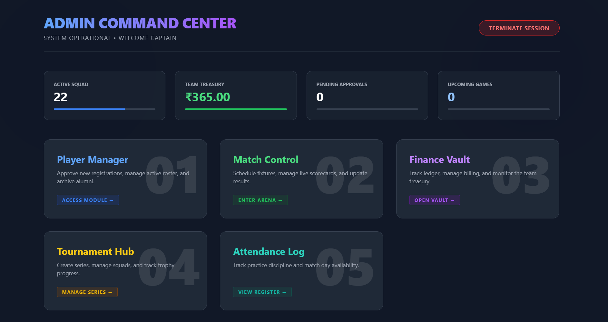
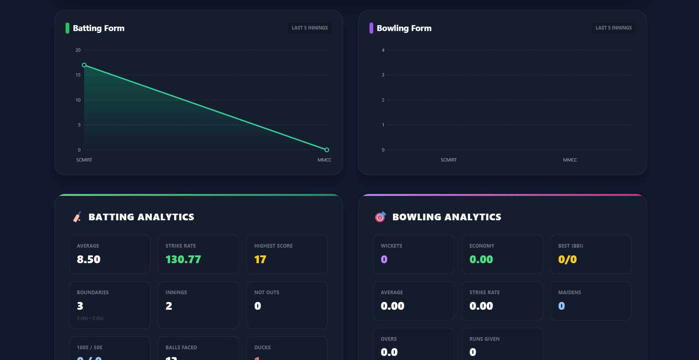
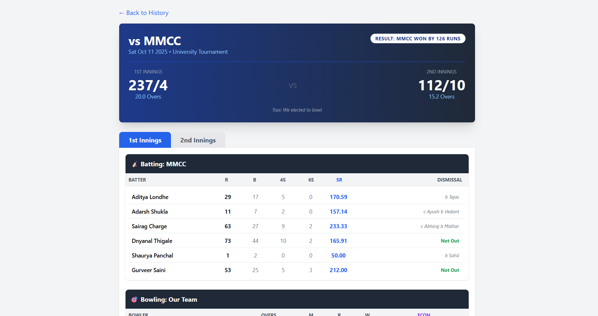
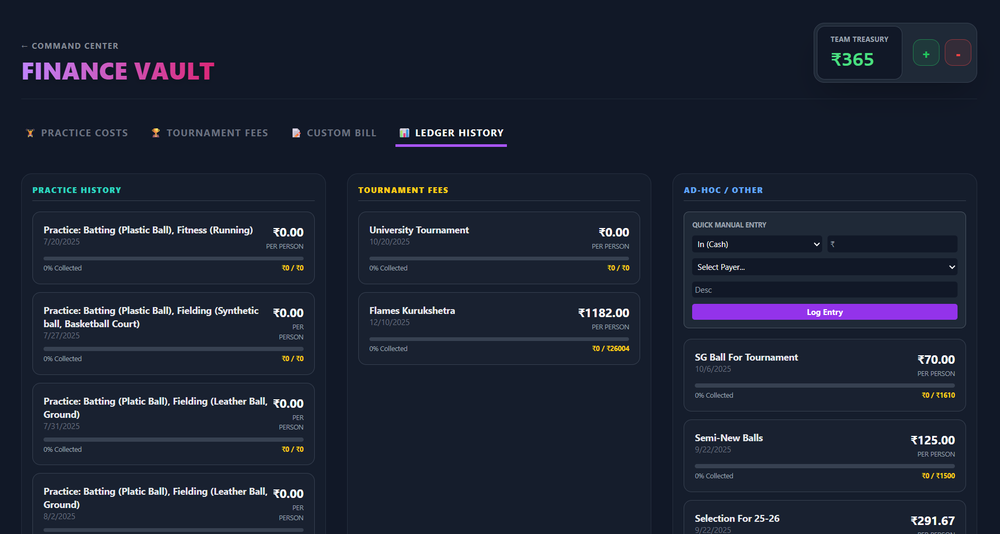
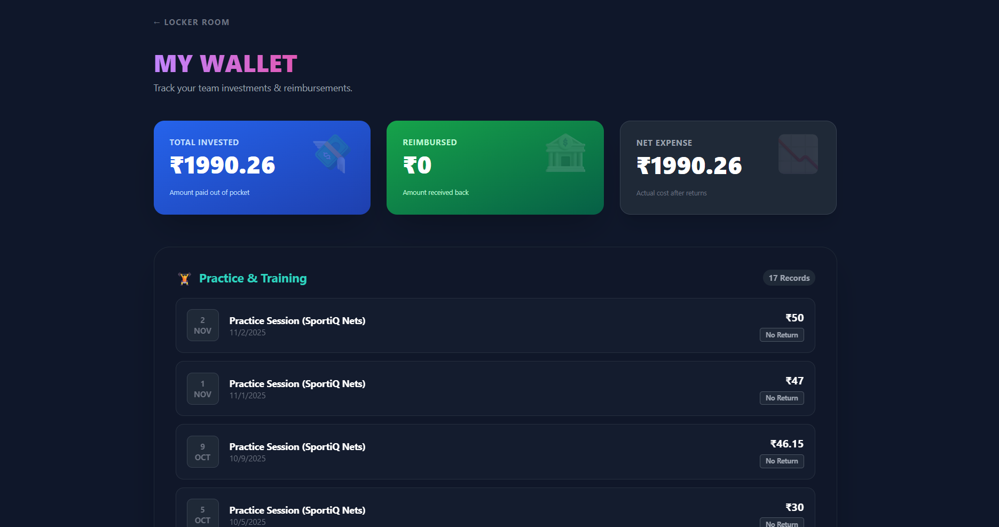
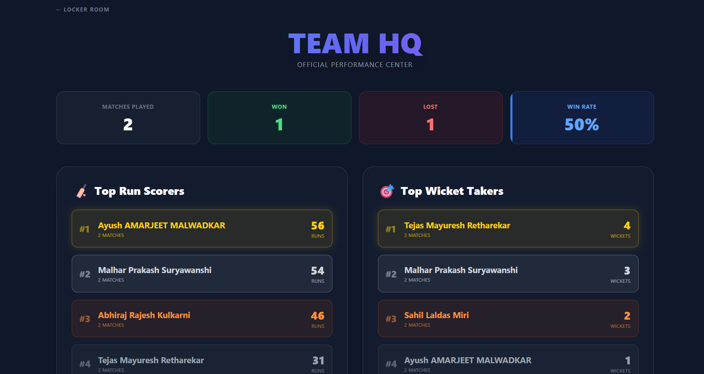

# 🏏 College Cricket Manager (The Team OS)

  

A high-performance, full-stack **PERN** application (PostgreSQL, Express, React, Node.js) designed to be the ultimate operating system for managing a college cricket team. It digitizes the entire ecosystem—from **Ball-by-Ball Scorecards** to **Financial Ledgers** and **Player Analytics**.

---

## 🚀 Features at a Glance

### 👑 Admin Command Center (God Mode)
* **📊 Live Telemetry Dashboard:** Real-time visualization of team funds, active squad strength, pending approvals, and upcoming fixtures.
* **📝 Pro Scorecard Engine:**
    * **Innings-Based Interface:** Separate tabs for 1st and 2nd innings with auto-switching logic.
    * **Drag-and-Drop Batting Order:** Adjust the lineup in real-time.
    * **Smart Dismissals:** Dynamic inputs for Catch/Bowl/Run-out details.
    * **Auto-Calculated Stats:** Updates career records (Runs, Wickets, Strike Rate) instantly upon saving.
* **💰 Finance Vault (Banker Model):**
    * **Split Billing:** Automatically divides practice/match costs among present players.
    * **Debt Tracking:** Tracks who paid the vendor (Banker) and who owes money to whom.
    * **Partial Reimbursements:** Manage partial payments and track pending dues.
    * **Team Treasury:** Manual fund adjustments for petty cash management.
* **📅 Attendance Manager (Time Travel):**
    * **Session-Based Logging:** Create Practice, Match, or Fitness sessions.
    * **Auto-Log:** Playing XI are automatically marked "Present" when a scorecard is saved.
    * **Time Travel:** View and edit attendance records for past dates using historical roster data.
* **👥 Squad Lifecycle:**
    * **Gatekeeper Auth:** New registrations are "Pending" until approved.
    * **Alumni System:** Archive seniors to a "Hall of Fame" while preserving their historical stats.

### 🧢 Player Locker Room (User View)
* **📈 Career Analytics:**
    * **Pro Stats:** Batting Average, Strike Rate, Economy, and Best Figures.
    * **Form Guide:** Interactive visualizations (Line & Bar Charts) showing performance in the last 5 matches.
* **🗓 Match History:** Digital log of every match played with personal performance highlights (Green for Wins, Red for Losses).
* **💸 My Wallet:** A banking-style breakdown of Total Invested, Reimbursements Received, and Net Expense.
* **🔒 Privacy:** View teammate stats without seeing sensitive contact/financial info.

---
## 📸 Screenshots

  <h3>Admin Dashboard</h3>
  
    
  <h3>Player Stats</h3>
  
    
  <h3>Full Scorecard</h3>
  
    
  <h3>Admin Finance</h3>
  
    
  <h3>Player Finance</h3>
  
    
  <h3>Team HQ</h3>
  

---

## 🛠️ Tech Stack

| Area | Technology | Description |
| :--- | :--- | :--- |
| **Frontend** | **React (Vite)** | Ultra-fast SPA with modern hooks and context API. |
| **Styling** | **Tailwind CSS** | Premium "Dark Mode" aesthetic with Glassmorphism effects. |
| **Backend** | **Node.js + Express** | RESTful API with secure routing, middleware, and error handling. |
| **Database** | **PostgreSQL** | Relational data model with complex Joins, Triggers, and ACID transactions. |
| **Auth** | **JWT + Bcrypt** | Secure session management, password hashing, and role-based access control. |
| **Charts** | **Recharts** | Interactive data visualization for player analytics. |

---

## 🗄️ Database Schema (Relational)

The system relies on a normalized PostgreSQL structure hosted on **NeonDB**.

* **`users`**: Stores profile, career totals, academic year, and lifecycle status (`active`/`alumni`/`pending`).
* **`matches`**: Stores fixture info, result summaries, and JSON snapshots for UI restoration.
* **`match_participation`**: Linked table tracking granular stats (balls faced, maiden overs, dismissal type) for every player in every match.
* **`finance_records`**: Double-entry ledger tracking bills (`amount`) vs collections (`reimbursed_amount`), linked to specific Events or Tournaments.
* **`attendance_logs`**: Links users to specific `attendance_events`.
* **`tournaments`**: Parent table for grouping matches and managing squad lists.

---
